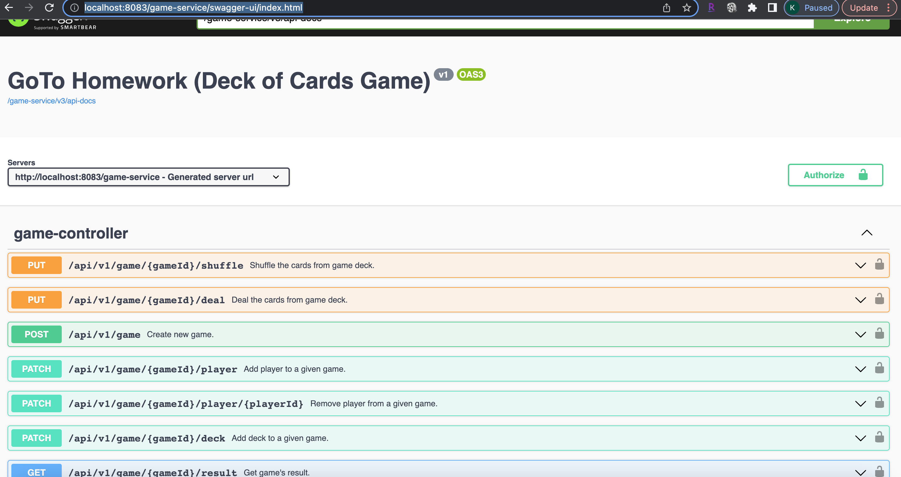

# Deck of Cards Game (GoTo Homework)

## Requirements

- Implement basic deck of cards game REST api.

## Endpoints

- Create and delete a game
- Create a deck
- Add a deck to a game deck
- Add and remove players from a game
- Deal cards to a player in a game from the game deck
- Get the list of cards for a player
- Get the list of players in a game along with the total added value of all the cards each
  player holds;
- Get the count of how many cards per suit are left undealt in the game deck
- Get the count of each card (suit and value) remaining in the game deck sorted by suit
- Shuffle the game deck (shoe)

## Technologies used

- spring boot
- spring webflux
- spring jpa
- docker, docker compose
- open api/swagger ui

## Assumptions

- cards are divided equally among all players resulting in some undealt cards in some games.

## Build and Run Application

The application can be built using maven command below and also generate a local
docker image. The jib maven plugin is being used here and the command is being
run from the root of each of the spring boot application folders.

```
cd ./card-service
mvn clean install jib:dockerBuild
```

```
cd ./player-service
mvn clean install jib:dockerBuild
```

```
cd ./game-service
mvn clean install jib:dockerBuild
```

The application can then be run using the following docker compose command. This
command also assumes you are at the root folder of the game-service application.

```
cd ./game-service
docker-compose -f ./src/main/docker/app.yml up
```

## Endpoints

The endpoints can be viewed using the following swagger ui url once the application is
running. The endpoints can also be tried out.

```
http://localhost:8083/game-service/swagger-ui/index.html
```





## Improvements

- additional unit and integration tests